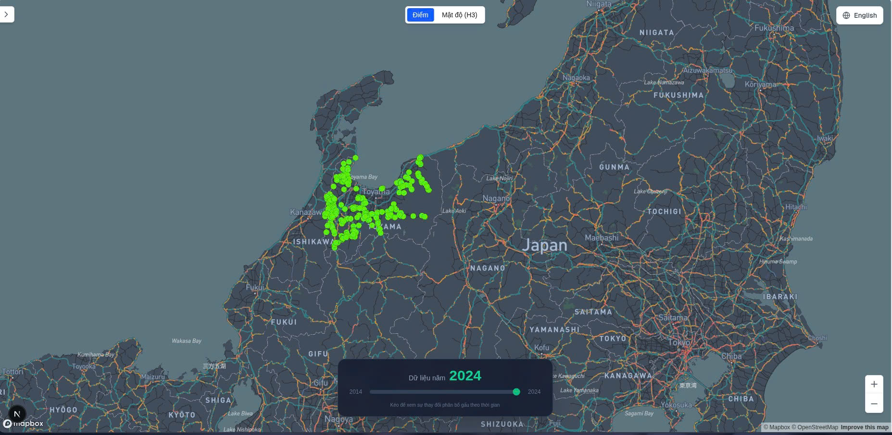
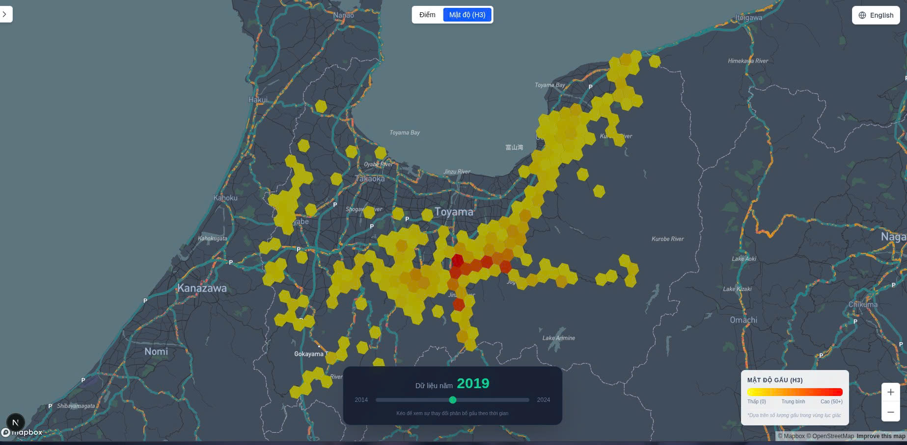

# Japan Bears Tracking System

[](https://nextjs.org/)
[](https://deck.gl/)
[](https://geoserver.org/)
[](https://postgis.net/)
[](https://h3geo.org/)

Hệ thống bản đồ tương tác trực quan hóa dữ liệu sự xuất hiện của gấu tại Nhật Bản theo chuỗi thời gian. Dự án kết hợp sức mạnh của **Vector Tiles** (GeoServer) để hiển thị hiệu năng cao với số lượng điểm lớn và **H3 Spatial Index** để phân tích mật độ (Heatmap).

---

## Demo




---

## Tính năng chính

* **Bản đồ nền Vector:** Tích hợp Mapbox GL JS làm bản đồ nền tối ưu.
* **Hiệu năng cao (Big Data):** Sử dụng **GeoServer** kết hợp **GeoWebCache** để phục vụ Vector Tiles (`.pbf`) và Raster Tiles.
* **Lọc theo thời gian thực:** Timeline Slider cho phép lọc dữ liệu gấu theo từng năm.
* **Phân tích mật độ (Clustering):** Sử dụng thuật toán **H3 (Uber)** để gom nhóm và hiển thị mật độ gấu theo độ phân giải động (Dynamic Resolution) dựa trên mức zoom.
* **Tìm kiếm thông minh:** API tìm kiếm hỗ trợ lọc theo thuộc tính.

---

## Kiến trúc hệ thống & Công nghệ

### 1. Frontend
* **Framework:** Next.js (React)
* **Map Engine:** Deck.gl (sử dụng `MVTLayer` cho Vector Tiles, `H3HexagonLayer` cho Cluster).
* **Base Map:** React-Map-GL (Mapbox wrapper).
* **Styling:** Tailwind CSS.

### 2. Backend API
* **Framework:** Node.js + Express.
* **Validation:** Zod .
* **Database Driver:** `pg` (node-postgres).
* **Spatial Logic:** `h3-js` (xử lý lục giác ngay tại server).

### 3. GIS Server & Database
* **Database:** PostgreSQL 14+ với extension **PostGIS**.
* **Map Server:** GeoServer.

---

## Hướng dẫn cài đặt 

### 1. Yêu cầu tiên quyết 
* Node.js >= 18
* Docker & Docker Compose (để chạy GeoServer & PostGIS)
* Mapbox Access Token

### 2. Thiết lập Database (PostgreSQL + PostGIS)

 * Import các nguồn dữ liệu rời rạc (CSV/Shapefiles) vào **QGIS**.
 * Thực hiện gộp (Merge) các layer lại thành một tập dữ liệu thống nhất.
 * Export trực tiếp từ QGIS vào **PostgreSQL/PostGIS**.
 * **Master Table:** Dữ liệu gốc được lưu tại bảng duy nhất `japan_bears` (có đánh index không gian).
* **SQL Views:** Tạo các bảng ảo (Views) từ bảng gốc (ví dụ: `japan_bears_2016`) để phục vụ việc hiển thị và Tile Caching trên GeoServer được tối ưu.

### 3. Cấu hình GeoServer

Các bước thiết lập để phục vụ Vector Tiles:

1.  **Khởi tạo Workspace:**
    * Tạo workspace mới với tên: `map-project`.
    * Namespace URI: `http://localhost/geoserver/map-project`.

2.  **Publish Layers:**
    * Import các bảng dữ liệu từ PostGIS Store và publish thành các Layer tương ứng.

3.  **Thiết lập Tile Caching (Vector Tiles):**
    * Trong tab **Tile Caching** của từng layer:
    * Bật tùy chọn *Create a cached layer for this layer*.
    * Tại mục **Tile Image Formats**, tích chọn định dạng **`application/vnd.mapbox-vector-tile`** (đây là format PBF chuẩn để Deck.gl có thể đọc và render phía client).

## Khởi chạy
### 1. Clone dự án
``` shell
git clone https://github.com/ThienND04/map-project.git
cd map-project 
```
### 2. Backend
Cài đặt geoserver và postgis
``` shell
cd backend
docker-compose up -d
```

Cài đặt dependency
``` shell
npm install
```

Tạo file .env từ .env.example rồi thay thế các biến môi trường

Chạy
``` shell
npm run dev
```
Backend sẽ chạy trên http://localhost:4000
Api documentations: http://localhost:4000/api/v1/docs

### 3. Frontend 
Cài đặt dependency
``` shell
cd ../frontend
npm install
```
Chạy
``` shell
npm run dev
```
Frontend sẽ chạy trên http://localhost:3000

---

Author: ThienND04 | Contact: nguyenducthien808@gmail.com